# REPORT.md — Actividad 2: HTTP, DNS, TLS y 12-Factor

## 1. HTTP: Fundamentos, métodos y logs

### a) Ejecución de la app con variables de entorno

```bash
PORT=8080 MESSAGE="Hola CC3S2" RELEASE="v1" python3 app.py
```

**Salida (stdout):**

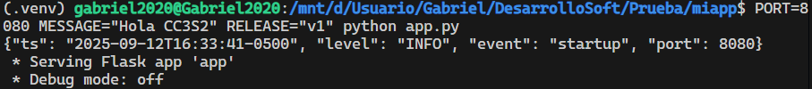

### b) Inspección con curl

**Comando:**

```bash
curl -v http://127.0.0.1:8080/
```

**Respuesta esperada:**
Cabeceras HTTP, código 200, cuerpo JSON:

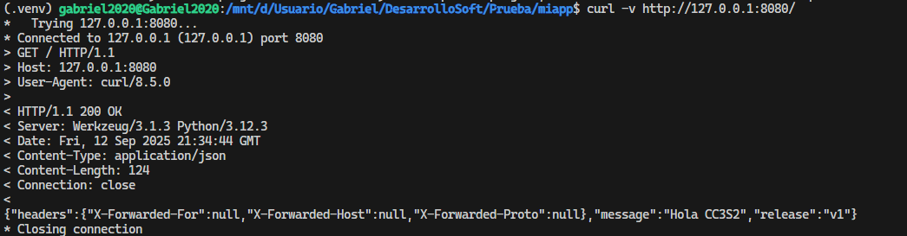

**Comando:**

```bash
curl -i -X POST http://127.0.0.1:8080/
```

**Respuesta esperada:**
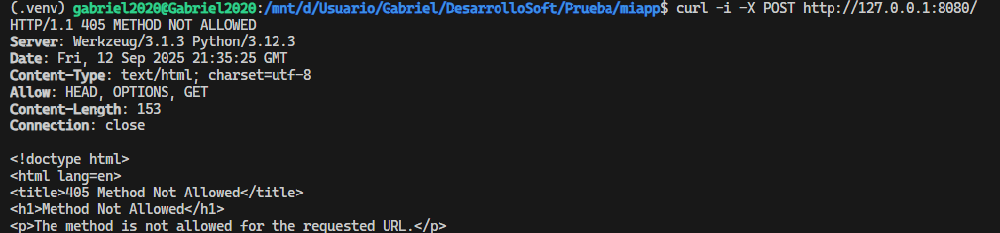

### c) Puertos abiertos

**Comando:**

```bash
ss -ltnp | grep :8080
```

**Salida:**
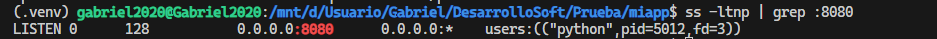

### d) Logs como flujo (stdout)

**Ejemplo de logs:**

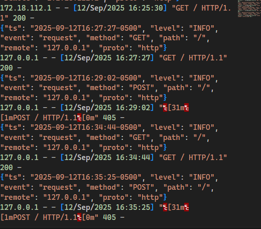

**Explicación:**
En mi caso, los logs salen directo por la terminal (stdout), así puedo verlos en tiempo real o redirigirlos fácilmente a un archivo si quiero. Esto me parece mucho más práctico que tener que buscar un archivo de logs, y además es lo que recomienda el enfoque 12-Factor para que cualquier sistema (como Docker o systemd) pueda recolectar los logs sin complicaciones.

### e) Idempotencia de métodos y su impacto en retries/health checks

Cuando hablamos de idempotencia en HTTP, nos referimos a que puedes hacer la misma petición varias veces y el resultado no cambia después de la primera vez. Por ejemplo, si hago un PUT varias veces sobre el mismo recurso, no pasa nada extra. En cambio, si hago varios POST, puedo terminar creando varios recursos o cambiando el estado cada vez. Esto es clave para los sistemas que hacen reintentos automáticos o chequeos de salud, porque así no se generan efectos secundarios inesperados.

**Ejemplo:**

- Si hago `curl -X PUT http://127.0.0.1:8080/recurso` varias veces, el recurso queda igual.
- Si hago `curl -X POST http://127.0.0.1:8080/recurso` varias veces, puedo crear varios recursos.

---

## 2. DNS: nombres, registros y caché

### a) Hosts local y comprobación

**Comando:**

```bash
getent hosts miapp.local
```

**Salida esperada:**
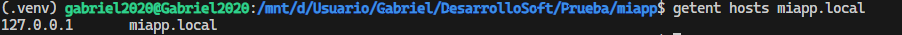

### b) TTL/caché

**Comando:**

```bash
dig example.com A +ttlunits
```

**Salida Esperada**

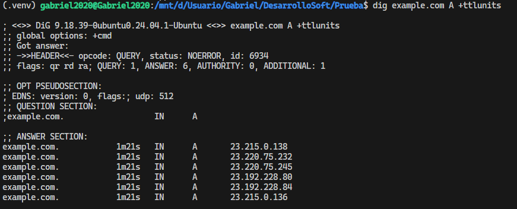

**Explicación:**
El TTL (Time To Live) es básicamente el tiempo que una respuesta DNS se guarda en caché. Si el TTL es alto, las respuestas se guardan más tiempo y eso hace que las consultas sean más rápidas y se reduzca la carga en los servidores DNS. Pero si cambias algo en la configuración DNS, puede tardar más en propagarse por culpa de ese caché.

### c) Diferencia entre /etc/hosts y zona DNS autoritativa

El archivo `/etc/hosts` es útil en laboratorio porque permite forzar la resolución de nombres localmente, sin depender de un servidor DNS externo. Sin embargo, no es escalable ni centralizado para producción, donde se requiere una zona DNS autoritativa.

---

## 3. TLS: seguridad en tránsito con Nginx

### a) Handshake y SNI

**Comando:**

```bash
openssl s_client -connect miapp.local:443 -servername miapp.local -brief
```

**Salida Esperada:**
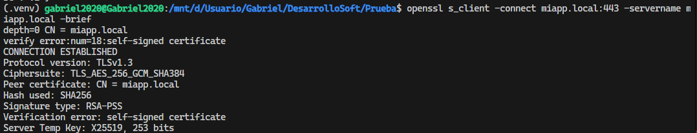

**Explicación:**
SNI (Server Name Indication) sirve para que el servidor TLS sepa para qué dominio le están pidiendo el certificado, aunque haya varios dominios en la misma IP. Cuando probé con el comando, vi que el servidor respondía con el certificado correcto para miapp.local, así que la configuración estaba bien.

### b) curl con certificado autofirmado

**Comando:**

```bash
curl -k https://miapp.local/
```

**Salida esperada:**
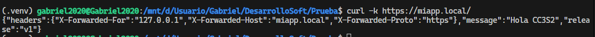

**Explicación:**
El parámetro `-k` en curl me permitió hacer la prueba aunque el certificado fuera autofirmado, que es lo típico en un entorno de laboratorio como este.

### c) Puertos y logs

**Comando:**

```bash
ss -ltnp | grep -E ':(443|8080)'
```

**Salida Esperada:**
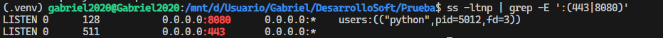

**Comando:**

Se usa este comando en vez del otro ya que estoy usando wsl donde nginx no está registrado como servicio de systemd

```bash
sudo tail -n 50 /var/log/nginx/error.log
```

**Salida esperada:**

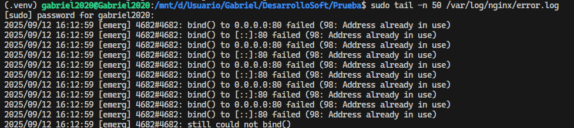

---

## 4. 12-Factor App: port binding, configuración y logs

- **Port binding:** La app escucha en el puerto indicado por `PORT`

**Evidencia**
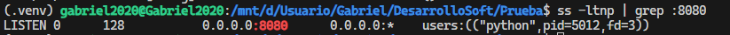.

- **Config por entorno:** Cambia `MESSAGE`/`RELEASE` y reinicia la app para ver el efecto en la respuesta JSON.

**Configuracion 1**
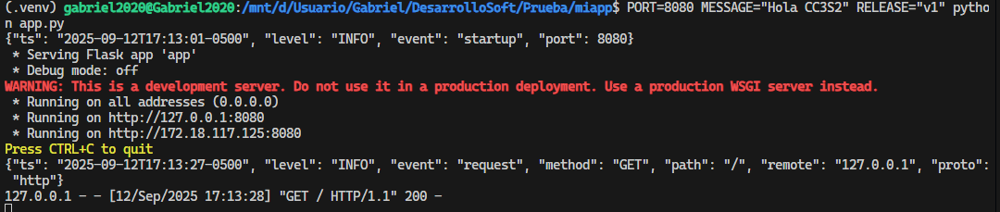
**Salida**


**Configuracion 2**

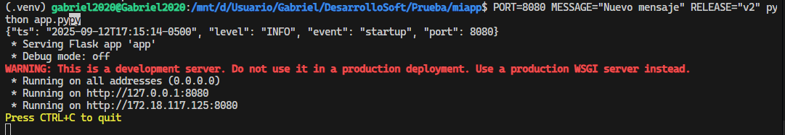

**Salida**

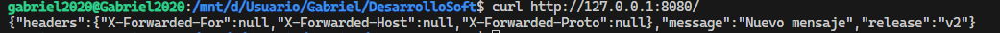

- **Logs a stdout:**
No puse un archivo de log en la app porque, siguiendo el principio 12-Factor, los logs deben ir a stdout/stderr. Así cualquier sistema (CLI, systemd, Docker, CI/CD) puede recolectar, redirigir o agregar los logs fácilmente, sin depender de rutas o archivos locales. Además, es mucho más cómodo para pruebas y para ver qué pasa en tiempo real.

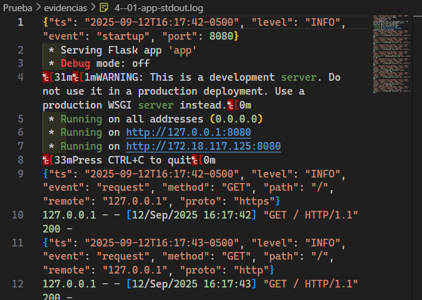

---

## 5. Operación reproducible y diagnóstico

- **Diferencias encontradas en WSL:**
  - Para ver logs de Nginx, usé `sudo tail -n 50 /var/log/nginx/error.log` porque `journalctl` no muestra logs de servicios en WSL.
  - El target `make hosts-setup` funciona igual que en Linux, agregando la entrada a `/etc/hosts`.
  - El comando `dig` no resuelve nombres definidos solo en `/etc/hosts`, pero `getent hosts` sí.

**Tabla: Comando -> Resultado esperado**

| Comando | Resultado esperado |
|---|---|
| `make prepare` | Crea entorno virtual, instala dependencias y genera app.py |
| `make run` | Inicia la app Flask en el puerto indicado por PORT |
| `make nginx` | Configura Nginx como reverse proxy y recarga el servicio |
| `make check-http` | Ejecuta pruebas HTTP con curl y muestra respuestas |
| `make dns-demo` | Demuestra resolución de nombres y TTL |
| `make check-tls` | Valida handshake TLS y acceso HTTPS |
| `make logs-pipeline` | Demuestra logs a stdout redirigidos por pipeline |

**Ejemplo de salida resumida de targets:**

**Comando**

```bash
make prepare
```

**Salida**
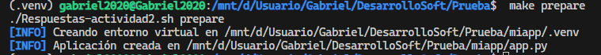

**Comando**

```bash
make run
```

**Salida**
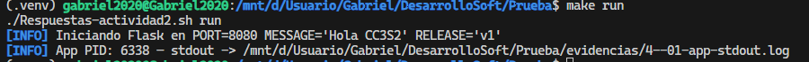

**Comando**

```bash
make nginx
```

**Salida**

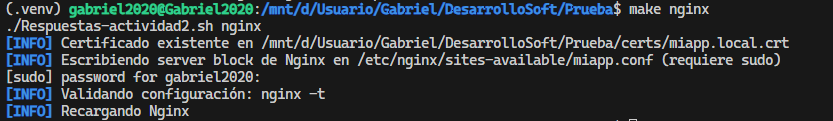

**Comando**

```bash
make logs-pipeline
```

**Salida**

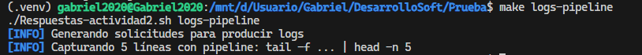

---
