# Actividad 6: Introducción a Git conceptos básicos y operaciones esenciales

## Ejercicio 1: Manejo avanzado de ramas y resolución de conflictos

Creé una nueva rama para trabajar separado:

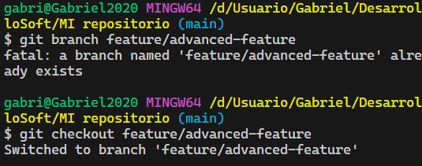

Cambié cosas en main.py desde la nueva rama:

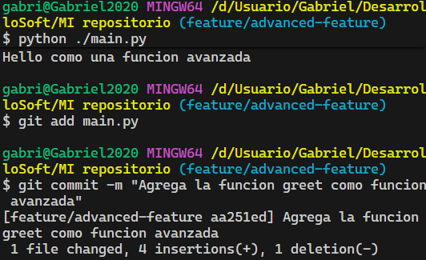

También modifiqué el mismo archivo desde main para que haya conflicto:

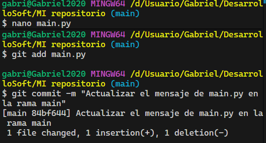

Al hacer merge salieron conflictos, los resolví editando el archivo:

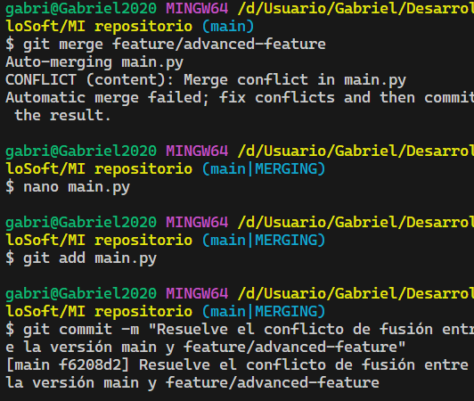

Borré la rama cuando ya no la necesitaba:

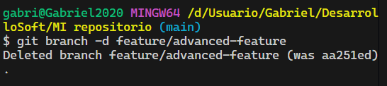

## Ejercicio 2: Exploración y manipulación del historial de commits

Aquí revisé el historial de commits. Los principales cambios fueron:

- Arreglé el conflicto entre main y feature/advanced-feature
- Cambié el mensaje en main.py
- Agregué la función greet() y arreglé un error (Print estaba mal escrito)

Para ver solo mis commits:

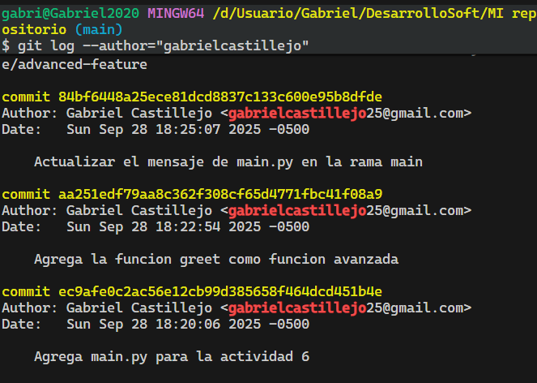

Hice rebase para limpiar el historial:

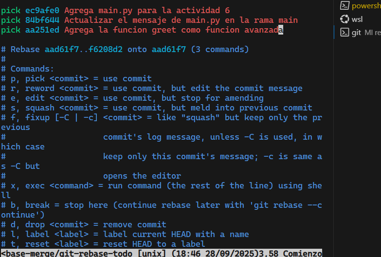

Usé squash para juntar varios commits en uno:

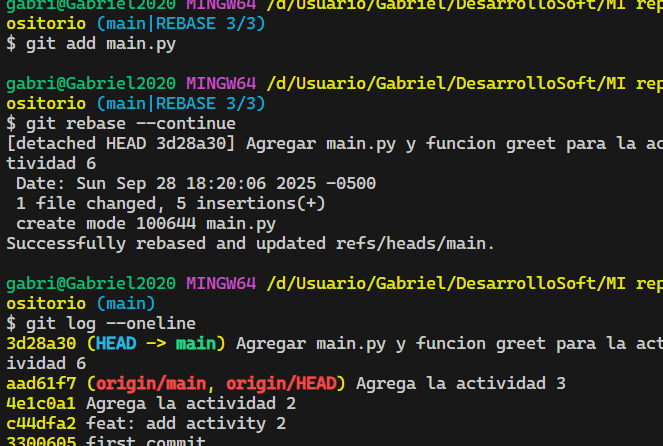

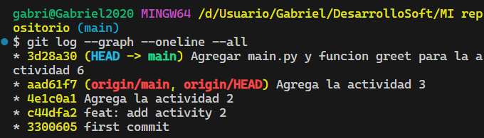

## Ejercicio 3: Creación y gestión de ramas desde commits específicos

Tenía un bug en la función greet(), lo arreglé:

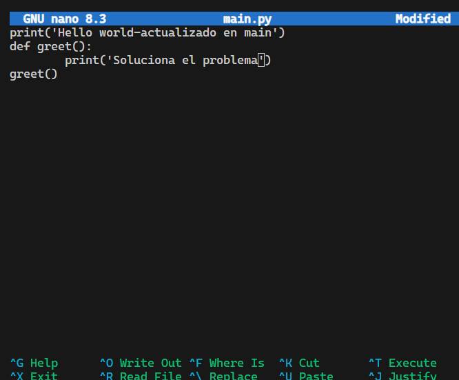

Hice commit del arreglo:

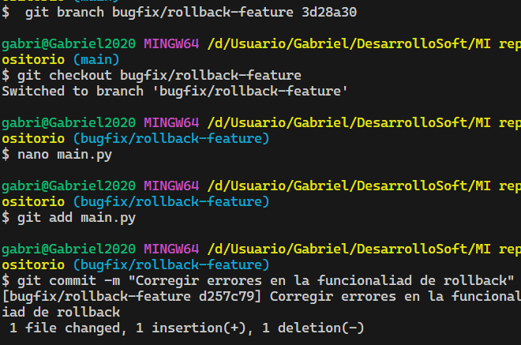

El merge fue automático (fast-forward):

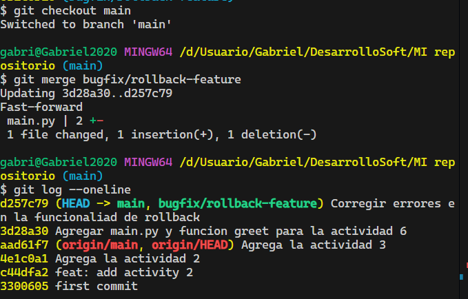

Para ver mejor cómo quedó el historial:

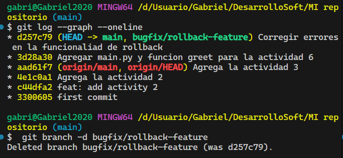

## Ejercicio 4: Manipulación y restauración de commits con git reset y git restore

Cambié main.py pero después me arrepentí:

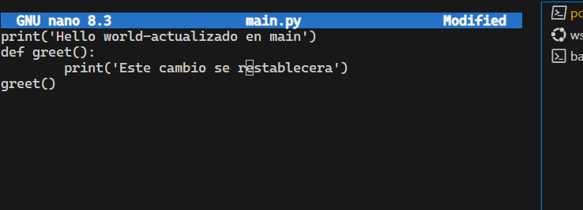

Deshice los cambios con git checkout:

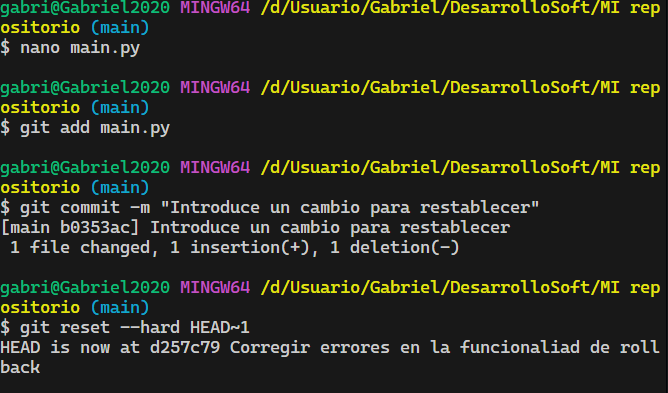

## Ejercicio 5: Trabajo colaborativo y manejo de Pull Requests

Subí mi código para hacer pull request:

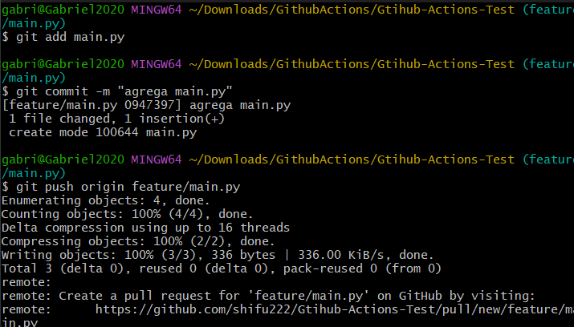

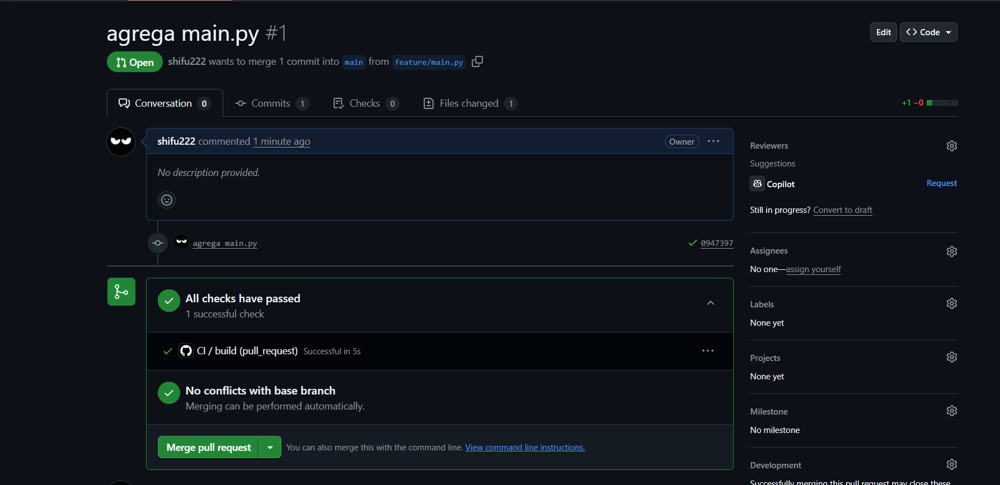

Me aceptaron el pull request:

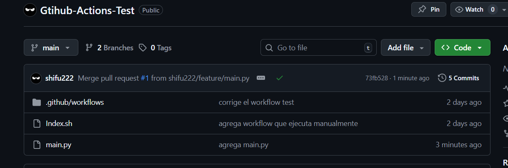

## Ejercicio 6: Cherry-Picking y Git Stash

Agregué una línea para probar cherry pick:

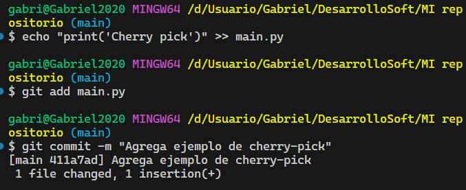

Hice una nueva rama para el cherry pick:

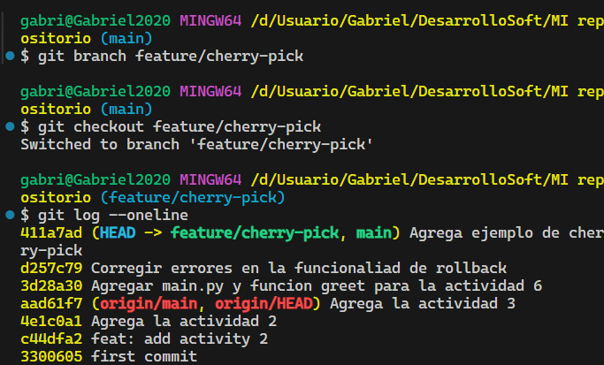

Guardé cambios en stash sin hacer commit:

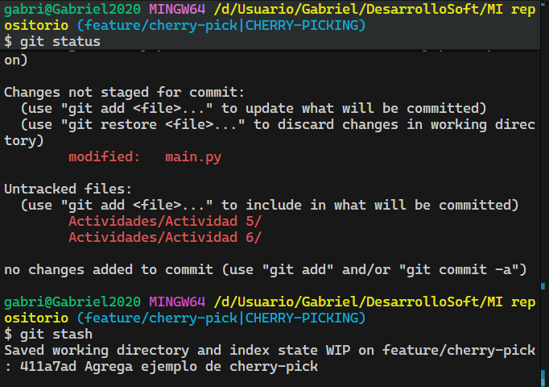

## Conclusiones

- Las ramas sirven para trabajar en paralelo
- Los conflictos se arreglan editando manualmente
- Rebase ayuda a mantener un historial limpio  
- Squash junta commits relacionados
- Cherry pick sirve para traer commits específicos
- Stash guarda cambios temporalmente
